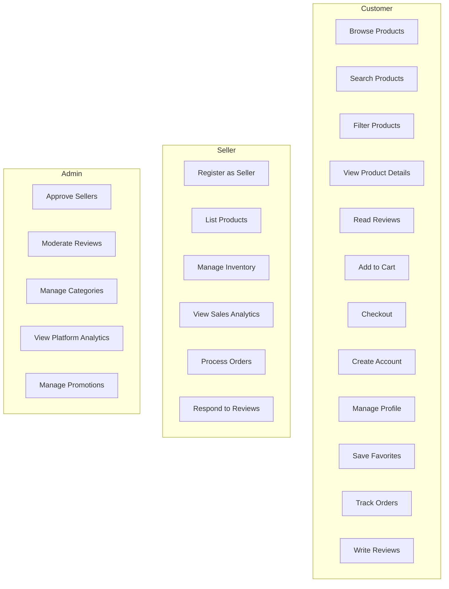
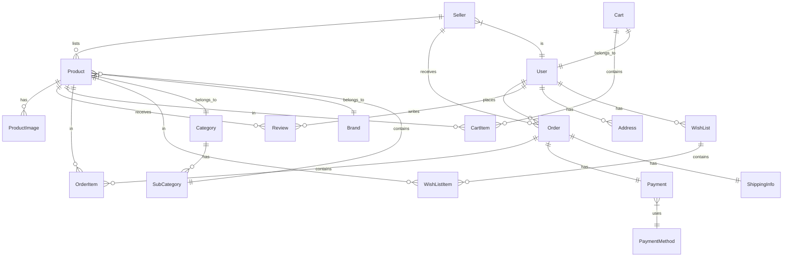
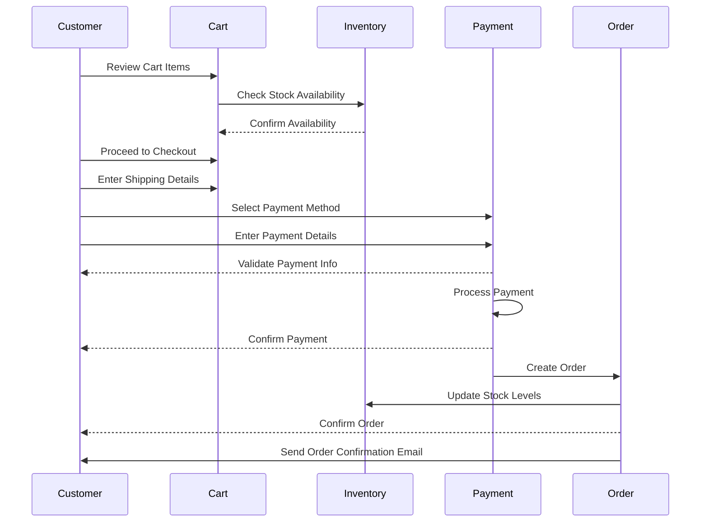
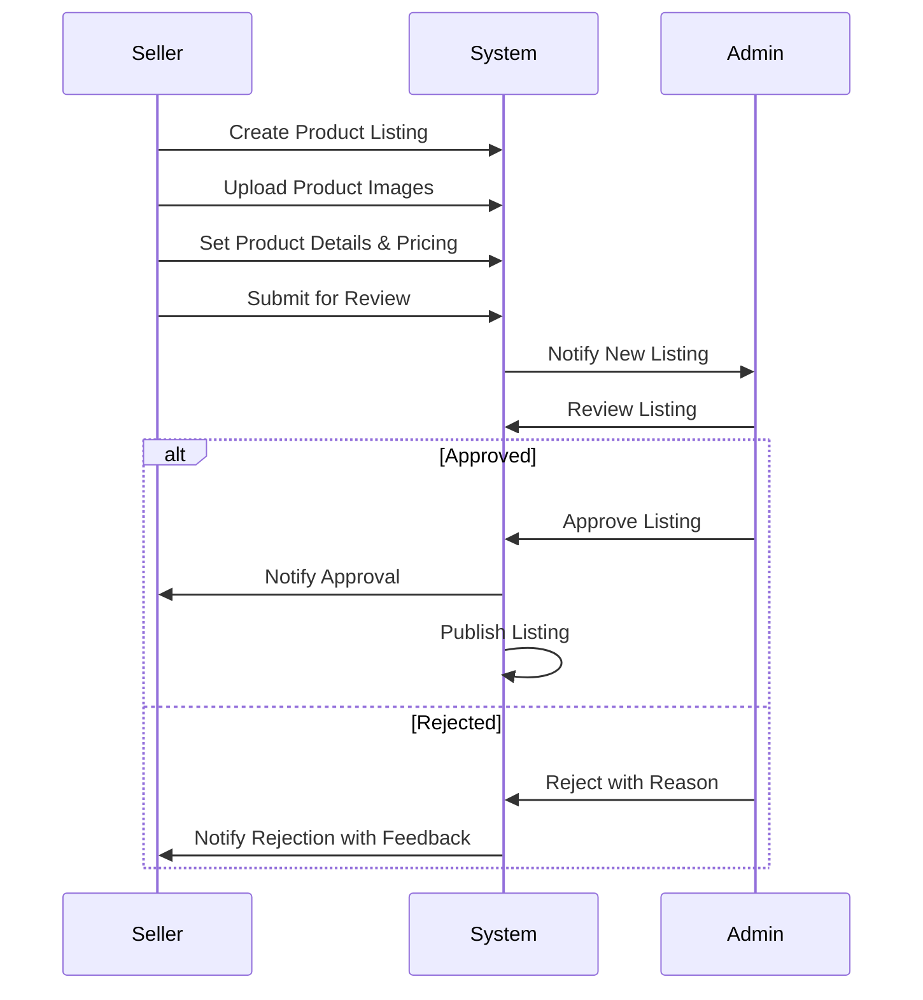

# FishingTackleHub Specification (v0.1)

## 1. Project Overview

FishingTackleHub is an e-commerce platform specializing in fishing tackle and equipment. The platform aims to provide a comprehensive marketplace where fishing enthusiasts can browse, compare, and purchase high-quality fishing gear from various brands and sellers.

## 2. User Stories

### Customer User Stories

```
As a fishing enthusiast, I want to browse fishing tackle by category so that I can find the specific equipment I need.
As a customer, I want to see detailed product specifications so that I can make informed purchasing decisions.
As a customer, I want to filter products by brand, price range, and rating so that I can narrow down my options.
As a returning customer, I want to save my favorite items so that I can easily find them later.
As a buyer, I want to read reviews from other users so that I can gauge the quality of products.
As a mobile user, I want the website to be responsive so that I can shop on my smartphone.
As a customer, I want to securely checkout using various payment options so that I can complete my purchase conveniently.
```

### Seller User Stories

```
As a seller, I want to list my fishing equipment so that customers can purchase my products.
As a seller, I want to manage my inventory so that I can update stock levels and product details.
As a seller, I want to view sales analytics so that I can understand my business performance.
As a seller, I want to respond to customer reviews so that I can address any concerns.
```

### Admin User Stories

```
As an admin, I want to approve new seller registrations so that I can maintain marketplace quality.
As an admin, I want to moderate user reviews so that I can ensure content complies with platform guidelines.
As an admin, I want to view overall platform analytics so that I can make data-driven decisions.
```

## 3. Use Case Diagram



## 4. Data Model

### Entity Relationship Diagram



### Entity Details

#### User Entity

| Field          | Type         | Description                              |
|----------------|--------------|------------------------------------------|
| id             | UUID         | Unique identifier                        |
| email          | String       | User's email address (unique)            |
| password_hash  | String       | Hashed password                          |
| first_name     | String       | User's first name                        |
| last_name      | String       | User's last name                         |
| phone_number   | String       | Contact phone number                     |
| created_at     | DateTime     | Account creation timestamp               |
| updated_at     | DateTime     | Last update timestamp                    |
| role           | Enum         | CUSTOMER, SELLER, ADMIN                  |
| status         | Enum         | ACTIVE, INACTIVE, SUSPENDED              |
| last_login     | DateTime     | Last login timestamp                     |

#### Product Entity

| Field          | Type         | Description                              |
|----------------|--------------|------------------------------------------|
| id             | UUID         | Unique identifier                        |
| seller_id      | UUID         | Reference to seller                      |
| category_id    | UUID         | Reference to category                    |
| brand_id       | UUID         | Reference to brand                       |
| name           | String       | Product name                             |
| description    | Text         | Detailed product description             |
| price          | Decimal      | Current price                            |
| compare_price  | Decimal      | Original price (for sale items)          |
| stock_quantity | Integer      | Available inventory count                |
| sku            | String       | Stock keeping unit (unique)              |
| weight         | Decimal      | Product weight (in grams)                |
| dimensions     | String       | Product dimensions (LxWxH)               |
| is_featured    | Boolean      | Featured product flag                    |
| is_active      | Boolean      | Product availability status              |
| avg_rating     | Decimal      | Average product rating                   |
| created_at     | DateTime     | Listing creation timestamp               |
| updated_at     | DateTime     | Last update timestamp                    |

#### Order Entity

| Field          | Type         | Description                              |
|----------------|--------------|------------------------------------------|
| id             | UUID         | Unique identifier                        |
| user_id        | UUID         | Reference to customer                    |
| status         | Enum         | PENDING, PROCESSING, SHIPPED, DELIVERED  |
| total_amount   | Decimal      | Order total amount                       |
| shipping_cost  | Decimal      | Shipping cost                            |
| tax_amount     | Decimal      | Tax amount                               |
| discount_amount| Decimal      | Discount amount                          |
| shipping_address_id | UUID    | Reference to shipping address            |
| billing_address_id | UUID     | Reference to billing address             |
| payment_id     | UUID         | Reference to payment                     |
| created_at     | DateTime     | Order creation timestamp                 |
| updated_at     | DateTime     | Last update timestamp                    |

## 5. Key Processes

### Checkout Process



### Product Listing Process



## 6. Business Rules Catalog

| ID   | Rule                                               | Description                                                                 | Implementation Notes                                      |
|------|-----------------------------------------------------|-----------------------------------------------------------------------------|----------------------------------------------------------|
| BR01 | Minimum Order Amount                                | Orders must be at least $10.00 to be processed                              | Validate at checkout before payment processing            |
| BR02 | Stock Validation                                    | Products must have available stock before being added to cart               | Check inventory when adding to cart and before checkout   |
| BR03 | Rating Calculation                                  | Product ratings are average of all approved reviews                         | Recalculate on new review approval                        |
| BR04 | Seller Approval                                     | New sellers must be approved by admin before listing products               | Admin interface for review and approval                   |
| BR05 | Return Eligibility                                  | Products are eligible for return within 30 days of delivery                 | Calculate based on delivery confirmation date             |
| BR06 | Quantity Discounts                                  | Bulk purchases (10+ identical items) receive 5% discount                    | Apply automatically at checkout                           |
| BR07 | Featured Product Selection                          | Products with 4.5+ rating and 10+ reviews are eligible for featuring        | Daily automated job to update featured products           |
| BR08 | Review Moderation                                   | All reviews must be approved by admin before publishing                     | Queue system for admin review                             |
| BR09 | Inventory Threshold Alerts                          | Alert sellers when product inventory falls below 10 items                   | Automated notification system                             |
| BR10 | Inactive Product Handling                           | Products with zero inventory for 90+ days are marked inactive               | Scheduled job to check and update product status          |

## 7. Non-Functional Requirements

### Performance Requirements
- Page load time under 2 seconds for product listings
- Search results returned in under 1 second
- Checkout process must handle 100 concurrent users
- System must support up to 10,000 product listings
- Database queries must execute in under 100ms

### Security Requirements
- PCI DSS compliance for payment processing
- HTTPS for all communications
- Password hashing using bcrypt
- Rate limiting for login attempts (max 5 attempts)
- Regular security audits and penetration testing
- User data encryption at rest

### Availability Requirements
- 99.9% uptime during business hours
- Scheduled maintenance windows during off-peak hours
- Automated backup system with daily backups
- Disaster recovery plan with RTO of 4 hours

### Scalability Requirements
- Horizontal scaling capability for web servers
- Database sharding strategy for growth beyond 1M products
- CDN integration for static assets
- Caching strategy for product listings and search results

### Usability Requirements
- Mobile-responsive design for all pages
- Accessibility compliance with WCAG 2.1 level AA
- Multi-language support (English, Spanish, French)
- Intuitive navigation with no more than 3 clicks to product

## 8. API Specifications

### Authentication Endpoints

```
POST /api/auth/register
POST /api/auth/login
POST /api/auth/refresh-token
POST /api/auth/forgot-password
POST /api/auth/reset-password
```

### Product Endpoints

```
GET /api/products
GET /api/products/{id}
GET /api/products/featured
GET /api/products/search?q={query}
GET /api/products/category/{categoryId}
POST /api/products (seller only)
PUT /api/products/{id} (seller only)
DELETE /api/products/{id} (seller only)
```

### Order Endpoints

```
GET /api/orders (user's orders)
GET /api/orders/{id}
POST /api/orders
PUT /api/orders/{id}/cancel
GET /api/seller/orders (seller only)
PUT /api/seller/orders/{id}/status (seller only)
```

### Review Endpoints

```
GET /api/products/{id}/reviews
POST /api/products/{id}/reviews
PUT /api/reviews/{id}
DELETE /api/reviews/{id}
GET /api/admin/reviews/pending (admin only)
PUT /api/admin/reviews/{id}/approve (admin only)
PUT /api/admin/reviews/{id}/reject (admin only)
```

## 9. Technical Stack

### Frontend
- React.js with TypeScript
- Redux for state management
- Tailwind CSS for styling
- Jest for testing
- Webpack for bundling

### Backend
- Node.js with Express
- TypeScript
- PostgreSQL database
- Prisma ORM
- JWT for authentication
- Jest for testing
- Swagger for API documentation

### DevOps & Infrastructure
- Docker for containerization
- AWS for cloud hosting
- GitHub Actions for CI/CD
- DataDog for monitoring
- ELK stack for logging