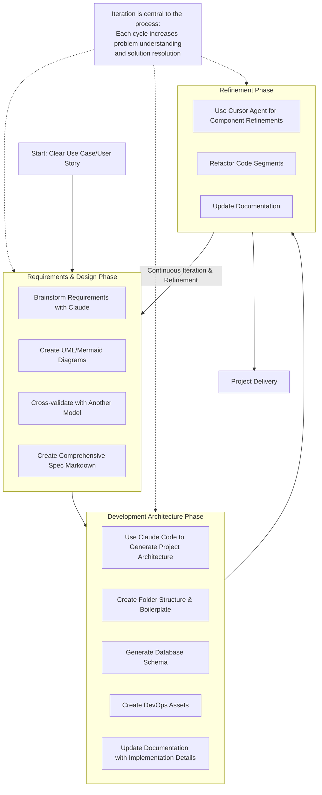

# dsr-flow: LLM-Assisted Development Methodology

[](https://opensource.org/licenses/MIT)

dsr-flow is a comprehensive, iterative approach to software development that leverages Large Language Models (LLMs) at each stage of the process. This methodology emphasizes thorough documentation, visual modeling, and continuous refinement to build high-quality software systems.

## 🌟 Key Features


- **LLM-Assisted Development** - Harness the power of Claude, Claude Code, and Cursor Agent for different phases of development
- **Iterative Requirements Discovery** - Progressive refinement of understanding through structured cycles
- **Strong Documentation Focus** - Comprehensive templates and Mermaid diagrams for clear visualization
- **Validated Design** - Cross-checking with multiple models to identify blind spots
- **Component-Level Refinement** - Targeted improvements without risking code base integrity

## 📚 Repository Contents

This repository contains the following resources:

- [dsr-flow Development Process Guide](./docs/dsr-process-detailed.md) - Comprehensive methodology guide
- [Requirements Document Template](./templates/requirements-template.md) - Markdown template for specification documents
- [FishingTackleHub Example](./examples/fishing-tackle-spec.md) - Complete example specification
- [dsr-flow Workflow Diagram](./diagrams/dsr-workflow-diagram.md) - Visual representation of the methodology

## 🔄 The dsr-flow Process

The dsr-flow methodology consists of four main phases:



## 🛠️ Recommended Tools

### LLM Tools
- **Claude** - Requirements gathering and ideation
- **Claude Code** - Critical architectural and design implementation
- **Cursor in Agent mode with Claude 3.7** - Component-level refinements

### Tech Stack
- **Frontend**: Vite, React, Tailwind CSS or Material UI
- **Backend**: Node.js
- **Database**: PostgreSQL with Prisma ORM
- **DevOps**: GitHub Actions, Docker

## 🚀 Getting Started

1. **Clone this repository**
   ```bash
   git clone https://github.com/yourusername/dsr-flow.git
   cd dsr-flow
   ```

2. **Review the process guide**
   - Start with the [dsr-flow Development Process Guide](./docs/dsr-process-detailed.md)
   - Understand the iterative nature and LLM-specific recommendations

3. **Use the template for your project**
   - Copy the [Requirements Document Template](./templates/requirements-template.md)
   - Review the [FishingTackleHub Example](./examples/fishing-tackle-spec.md) for guidance

4. **Begin your project with Requirements Discovery**
   - Start with a clear use case
   - Follow the iterative process outlined in the workflow diagram

## 📝 Documentation Philosophy

dsr-flow emphasizes that documentation is a living artifact that evolves alongside your understanding of the problem domain. Key principles include:

- Documentation should be updated with each iteration
- Visual diagrams should complement textual descriptions
- Requirements evolve as understanding deepens
- Cross-validation helps identify blind spots

## 📊 Example Specification

The repository includes a complete example specification for a fictional fishing tackle e-commerce site. This example demonstrates:

- Comprehensive user stories
- Detailed entity relationships
- Process flows using sequence diagrams
- Business rules catalog
- API specifications

Review the [FishingTackleHub Example](./examples/fishing-tackle-spec.md) to see how all components come together in a complete specification.

## 🤝 Contributing

Contributions to improve dsr-flow are welcome! Please feel free to submit a pull request with:

- Additional templates
- Process improvements
- Tool recommendations
- Example specifications

## 📄 License

This project is licensed under the MIT License - see the [LICENSE](./LICENSE) file for details.

## 📬 Contact

For questions or feedback about dsr-flow, please [open an issue](https://github.com/yourusername/dsr-flow/issues) on this repository.

---

*dsr-flow: Where LLMs meet software development methodology for clearer specifications, better architecture, and targeted refinements.*