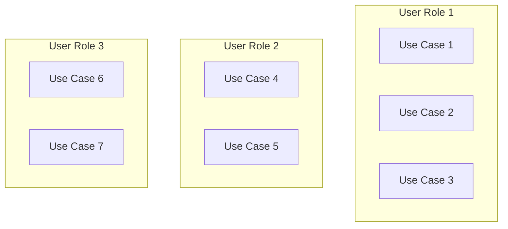
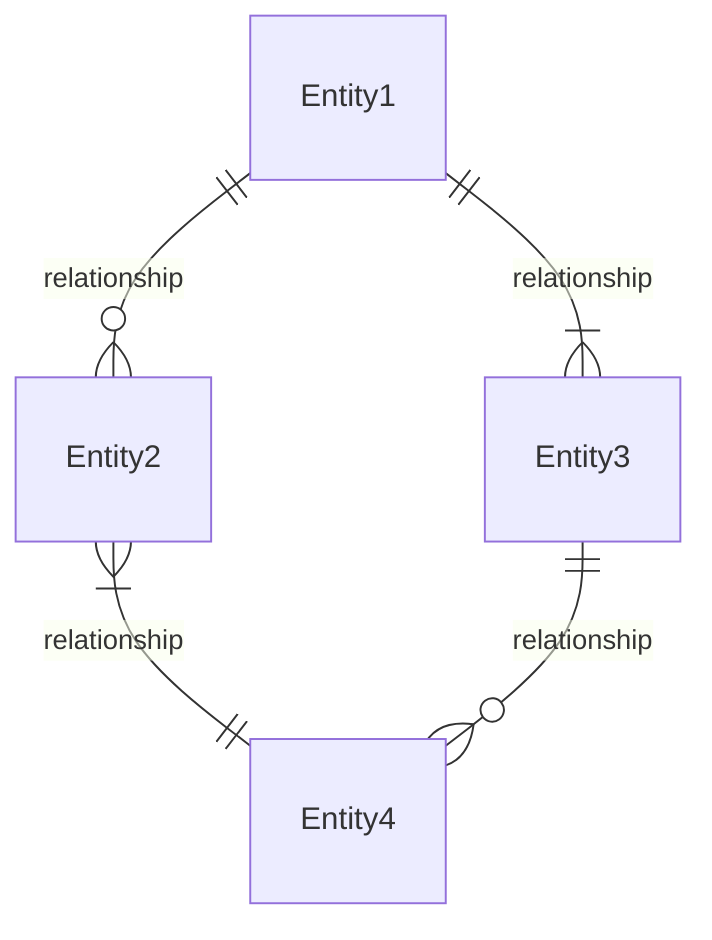
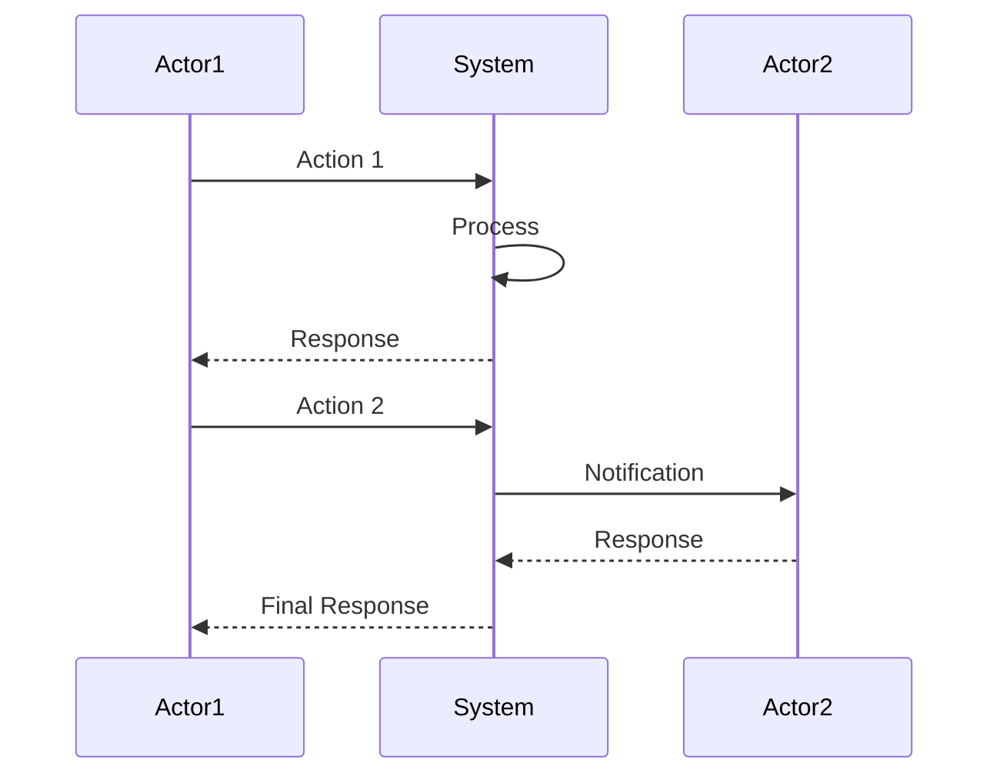
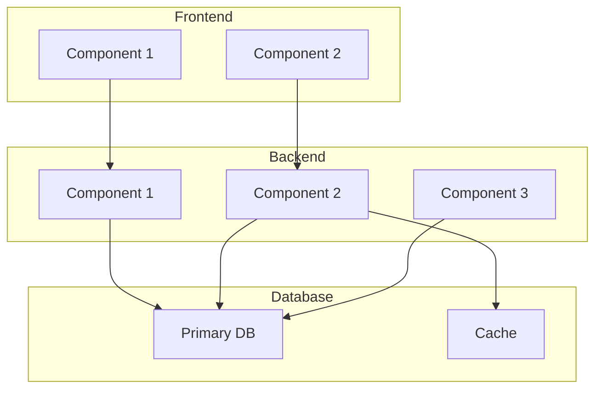
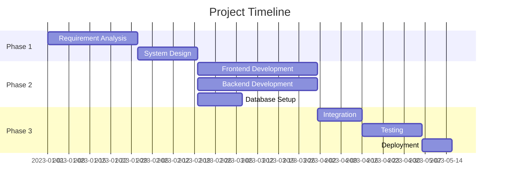

# [Project Name] Requirements Document

**Version:** [0.1]  
**Last Updated:** [YYYY-MM-DD]  
**Status:** [Draft/In Review/Approved]

## Process Overview

This requirements document represents a snapshot in the iterative DSR development process. As we progress through development cycles, we continuously refine our understanding of the problem space and solution requirements. Each iteration adds detail and increases the resolution of our understanding, with the document evolving accordingly.

**Iteration Philosophy:**

- Requirements evolve as our understanding deepens
- Each phase may prompt revisions to earlier decisions
- Documentation is a living artifact that grows in fidelity with each cycle
- Cross-model validation helps identify blind spots and opportunities for refinement

## 1. Project Overview

### 1.1 Purpose

[Concise statement of what the project aims to accomplish]

### 1.2 Scope

[Boundaries of the project - what's included and what's not]

### 1.3 Definitions and Acronyms

| Term | Definition |
|------|------------|
| [Term 1] | [Definition 1] |
| [Term 2] | [Definition 2] |

## 2. User Stories

### 2.1 [User Role 1] User Stories

```
As a [user role], I want to [action/capability], so that [benefit/value].
As a [user role], I want to [action/capability], so that [benefit/value].
```

### 2.2 [User Role 2] User Stories

```
As a [user role], I want to [action/capability], so that [benefit/value].
As a [user role], I want to [action/capability], so that [benefit/value].
```

## 3. Use Cases

### 3.1 Use Case Diagram



### 3.2 Detailed Use Cases

#### 3.2.1 [UC1] - [Use Case Name]

* **Actor:** [Primary actor]
- **Description:** [Brief description]
- **Preconditions:** [Conditions that must be true before the use case starts]
- **Main Flow:**
  1. [Step 1]
  2. [Step 2]
  3. [Step 3]
- **Alternative Flows:**
  - [Alternative A] - [Description]
  - [Alternative B] - [Description]
- **Postconditions:** [State of the system after the use case completes]

#### 3.2.2 [UC2] - [Use Case Name]

[Similar structure as above]

## 4. Data Model

### 4.1 Entity Relationship Diagram



### 4.2 Entity Definitions

#### 4.2.1 [Entity1]

| Field | Type | Description | Constraints |
|-------|------|-------------|-------------|
| id | UUID | Unique identifier | Primary Key |
| field1 | String | [Description] | [Constraints] |
| field2 | Integer | [Description] | [Constraints] |

#### 4.2.2 [Entity2]

| Field | Type | Description | Constraints |
|-------|------|-------------|-------------|
| id | UUID | Unique identifier | Primary Key |
| entity1_id | UUID | Reference to Entity1 | Foreign Key |
| field1 | String | [Description] | [Constraints] |

## 5. Key Processes

### 5.1 [Process 1 Name]



**Description:**
[Detailed explanation of the process]

### 5.2 [Process 2 Name]

```mermaid
sequenceDiagram
    [Similar structure as above]
```

## 6. System Architecture

### 6.1 Component Diagram



### 6.2 Component Descriptions

#### 6.2.1 [Component Name]

* **Purpose:** [Brief description]
- **Responsibilities:**
  - [Responsibility 1]
  - [Responsibility 2]
- **Dependencies:**
  - [Dependency 1]
  - [Dependency 2]

## 7. API Specifications

### 7.1 [Endpoint Group 1]

#### 7.1.1 `[HTTP Method] [Path]`

* **Description:** [Purpose of the endpoint]
- **Authentication:** [Required/Not Required]
- **Request Parameters:**
  
  | Parameter | Type | Required | Description |
  |-----------|------|----------|-------------|
  | [param1] | [type] | [Y/N] | [Description] |
  | [param2] | [type] | [Y/N] | [Description] |

- **Request Body:**

  ```json
  {
    "field1": "value1",
    "field2": "value2"
  }
  ```

- **Response:**
  - **Status Code:** [e.g., 200 OK]
  - **Body:**

    ```json
    {
      "field1": "value1",
      "field2": "value2"
    }
    ```

- **Error Responses:**
  - **Status Code:** [e.g., 400 Bad Request]
  - **Body:**

    ```json
    {
      "error": "Error message"
    }
    ```

## 8. Business Rules Catalog

| ID | Rule | Description | Implementation Notes |
|----|------|-------------|---------------------|
| BR01 | [Rule Name] | [Detailed description of the business rule] | [Notes on how to implement] |
| BR02 | [Rule Name] | [Detailed description of the business rule] | [Notes on how to implement] |

## 9. Non-Functional Requirements

### 9.1 Performance Requirements

- **Response Time:** [Specifications]
- **Throughput:** [Specifications]
- **Capacity:** [Specifications]

### 9.2 Security Requirements

- **Authentication:** [Specifications]
- **Authorization:** [Specifications]
- **Data Protection:** [Specifications]

### 9.3 Availability Requirements

- **Uptime:** [Specifications]
- **Maintenance Windows:** [Specifications]
- **Disaster Recovery:** [Specifications]

### 9.4 Scalability Requirements

- **Horizontal Scaling:** [Specifications]
- **Vertical Scaling:** [Specifications]
- **Load Balancing:** [Specifications]

### 9.5 Usability Requirements

- **Accessibility:** [Specifications]
- **Localization:** [Specifications]
- **User Interface:** [Specifications]

## 10. Technical Stack

### 10.1 Frontend

* **Framework:** [e.g., React, Angular]
- **State Management:** [e.g., Redux, Context API]
- **UI Library:** [e.g., Material UI, Bootstrap]
- **Testing:** [e.g., Jest, Cypress]

### 10.2 Backend

* **Language/Framework:** [e.g., Node.js/Express, Python/Django]
- **API Style:** [e.g., REST, GraphQL]
- **Authentication:** [e.g., JWT, OAuth]
- **Testing:** [e.g., Mocha, PyTest]

### 10.3 Database

* **Primary Database:** [e.g., PostgreSQL, MongoDB]
- **Caching:** [e.g., Redis, Memcached]
- **ORM/ODM:** [e.g., Sequelize, Mongoose]

### 10.4 DevOps

* **CI/CD:** [e.g., Jenkins, GitHub Actions]
- **Containerization:** [e.g., Docker, Kubernetes]
- **Hosting:** [e.g., AWS, Azure, GCP]
- **Monitoring:** [e.g., Prometheus, New Relic]

## 11. Implementation Timeline



## 12. Appendices

### 12.1 [Appendix Name]

[Additional information, references, or supporting documentation]

### 12.2 [Appendix Name]

[Additional information, references, or supporting documentation]
